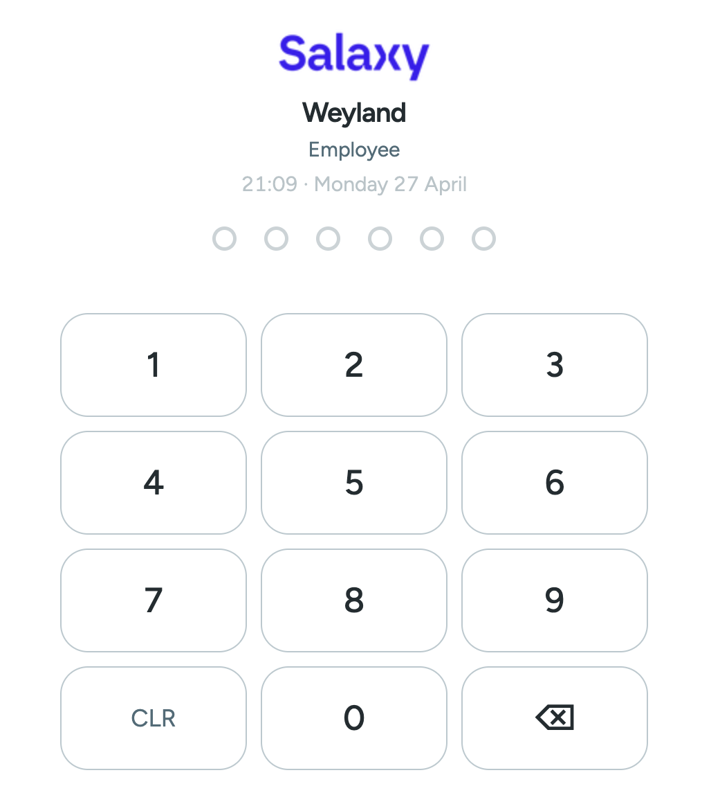
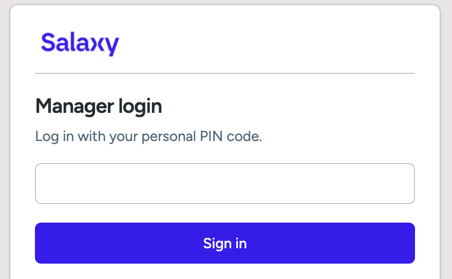
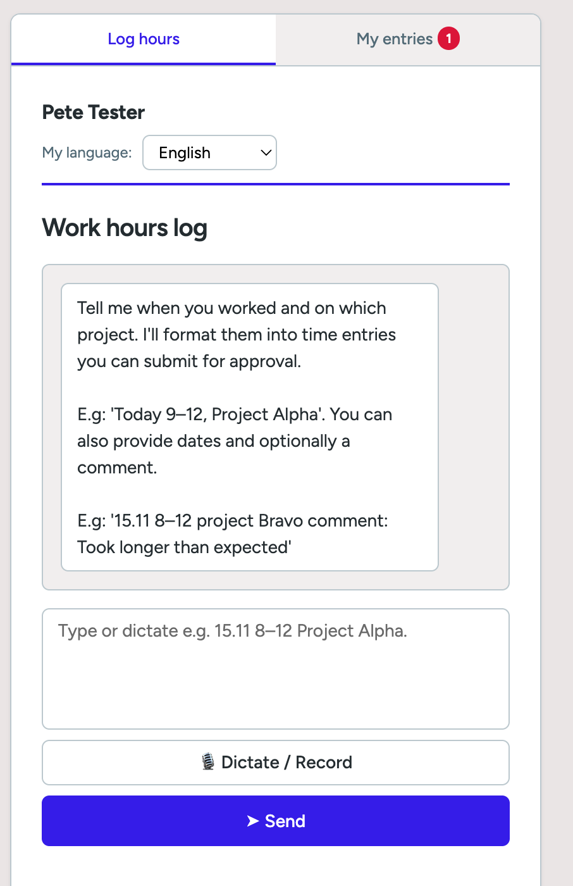
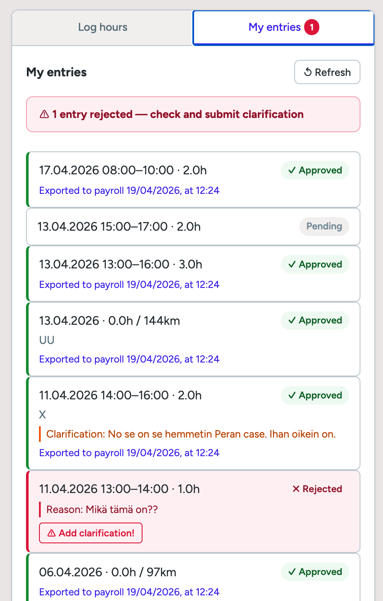
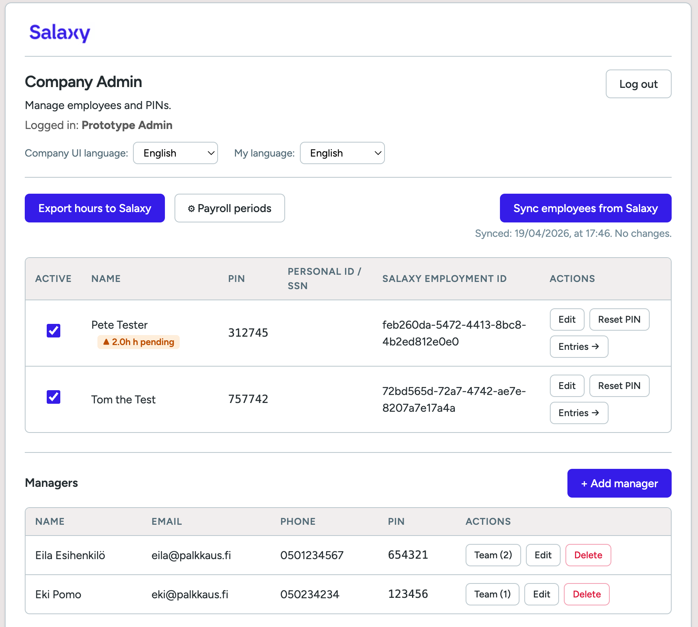
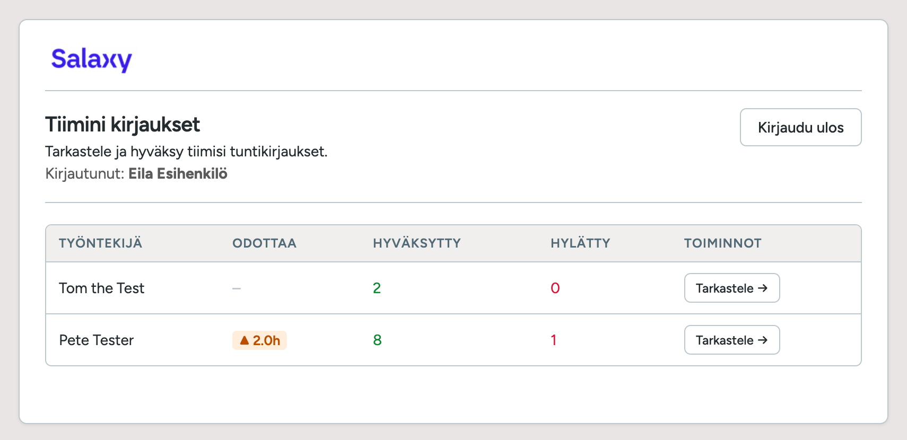
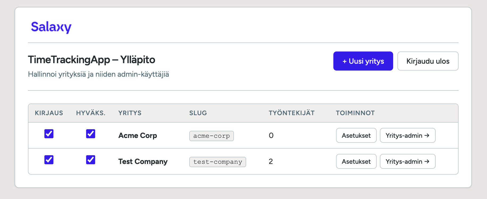

# TimeTrackingApp

An easy to use, AI-powered time tracking solution seamlessly integrated with **[Salaxy](https://salaxy.com)** - the real-time, open API payroll platform trusted by forward-thinking businesses.

Focus is on usability: easy for employees to log hours and easy for manager to approve!

## Overview

TimeTrackingApp extends Salaxy's automated payroll capabilities by providing an intuitive time and expense tracking interface for small and medium enterprises. Built on Salaxy's powerful Open API, it demonstrates how developers can create value-added solutions that integrate directly with real-time payroll processing.
Support for multiple UI languages, easy to add more locales when needed.

## Key Features

### Very Easy Login and Time Entry
- **Login with PIN**: Employees login with PIN. Works with simple URL on any phone. Nothing else needed!
- **Voice & Text Input**: Employees log hours using conversational AI (text or speech)
- **Smart Interpretation**: AI understands natural language entries like "worked 8 hours on client project today"
- **Confirmation Flow**: Interactive dialogue ensures accuracy before submission

### Streamlined Approval Workflow
- **Very Easy to Use for Supervisors/Manager**: Manager login with PIN. Works with simple URL on any phone!
- **Manager Review**: Company managers can approve, reject, or request clarification on entries
- **Expense Management**: Handle both time and expense submissions in one workflow
- **Audit Trail**: Complete history of all submissions and approvals

### Direct Payroll Integration
- **One-Click Sync**: Approved entries flow directly to Salaxy payroll
- **Automatic Payroll Updates**: System generates and updates open payroll periods
- **Real-Time Processing**: Changes reflect immediately in Salaxy's payroll calculations

### Multi-Company Management
- **Super Admin Dashboard**: Manage multiple companies from a centralized interface
- **Automatic Employee Sync**: Employees are synchronized in real-time from Salaxy's payroll system
- **Company-Level Administration**: Each company admin has full control over their workforce

### Multi-Language Support
- UI languages can be added easily
- This package has ENG, FIN, SWE, EST, UKR locales

## Why Build on Salaxy?

This project showcases the power of Salaxy's modern payroll infrastructure:

- **Open API First**: RESTful, OpenAPI-compliant endpoints make integration straightforward
- **Real-Time Processing**: No batch delays - see changes instantly
- **AI Integrated**: AI helps payroll users and platform is built for the future with Salaxy AI architecture
- **Developer-Friendly**: Comprehensive documentation, test environments, and consistent APIs
- **Break Free from Legacy**: Unlike closed-box solutions, Salaxy empowers developers to innovate

---

## Features

**Employee**
- PIN-based login at a company-specific URL (`/{slug}/`)
- Voice or text input — natural language like *"Yesterday 2h on project Alpha"*
- Gemini AI interprets entries, asks follow-up questions if details are missing, and shows a summary before sending
- Entries exported to Salaxy payroll via API — one payroll created per day, entries added as payslip items
- Mileage allowance (km-korvaus) support, easy to add more entry types

**Company supervisor/managers** (`/{slug}/approval/`)
- Manage approval of entries: approve/reject/ask clarification.

**Company admin** (`/{slug}/admin/`)
- Manage employees: add, edit, deactivate, reset PIN
- Manage teams and managers: who works in what team and who are the managers in approval
- Sync employees from Salaxy with one click — new employees are imported, existing ones updated
- Sync status shown inline: last synced timestamp, or error reason on failure
- Auto-sync on every admin login

**Super-admin** (`/admin/`)
- Create and manage companies with a slug-based URL and admin account
- Enable or disable time tracking per company via an inline toggle
- Manage admins of each company
- Navigate directly to each company's admin panel

---

## Screenshots

**Simple PIN login** — each company has its own login URL at `/{slug}/`.
Employees and managers/supervisors only need to open URL on any device and give their unique PIN.
Nothing else is needed for onboarding, no configuration or installing anything!





---

**Time entry** — employees describe their hours in plain language. The AI confirms details and shows a summary before the entry is sent to manager for approval.



Employees can see the entries they have made and follow the approval process. They can also comment if managers have questions about the entries.



---

**Company admin** — manage employees, reset PINs, and sync from Salaxy. Sync status and timestamp are shown inline next to the sync button.



---

**Approvals** — supervisors/managers can follow the entries sent by their employees and approve them. They can also ask for more information about the entries.
Managers only need to open URL on any device and give their unique PIN.
Nothing else is needed for onboarding, no configuration or installing anything!



---

**Super-admin** — all companies in one table. The first column toggles time tracking on/off per company without leaving the page.



---

## Tech Stack

| Layer | Technology |
|---|---|
| Frontend | Vanilla JS, HTML/CSS — Figtree font, Salaxy design tokens |
| i18n | Flat JSON locale files (`locales/`), runtime-loaded via `js/i18n.js` |
| Backend | PHP 8+, SQLite via PDO |
| AI | Google Gemini API (natural language → structured time entry) |
| Payroll | Salaxy REST API — OAuth2 token auth, employee sync, payroll export |
| Dev server | PHP built-in server with `router.php` for slug-based routing |
| Production | Apache with `.htaccess` rewrites |

### Supported languages

| Code | Language |
|---|---|
| `en` | English |
| `fi` | Suomi |
| `sv` | Svenska |
| `et` | Eesti |
| `uk` | Українська |
| `xh` | isiXhosa |

Languages can be set per company, per employee, and per supervisor independently. Adding a new locale requires only a new JSON file in `locales/` and a one-line addition in `js/i18n.js`.

---

## URL Structure

| Path | Description |
|---|---|
| `/{slug}/` | Employee PIN login and time entry |
| `/{slug}/approval/` | Supervisor/manager approval portal |
| `/{slug}/admin/` | Company admin dashboard |
| `/admin/` | Super-admin: all companies |
| `/api/employees.php` | Employee CRUD |
| `/api/supervisors.php` | Supervisor CRUD |
| `/api/time_entries.php` | Time entry read/delete |
| `/api/review_entries.php` | Approve / reject / clarify entries |
| `/api/export_payroll.php` | Export approved entries to Salaxy |
| `/api/sync_employees_from_salaxy.php` | Sync employees from Salaxy |
| `/api/update_language.php` | Update UI language preference |
| `/api/company_lang.php` | Get company default language |

---

## Getting Started

### Prerequisites

- PHP 8.0+
- A [Google Gemini API key](https://aistudio.google.com/app/apikey)
- Salaxy API credentials (URL, username, password) — contact [Salaxy](https://salaxy.com) for API access

### Installation

1. Clone the repository:
   ```bash
   git clone https://github.com/jisosavi/TimeTrackingApp.git
   cd TimeTrackingApp
   ```

2. Configure `config.php` with your credentials:
   ```php
   define('GEMINI_API_KEY',  'your-gemini-api-key');
   define('SALAXY_API_URL',  'https://api.salaxy.com/v03/api');
   define('SALAXY_TOKEN_URL','https://api.salaxy.com/oauth2/token');
   define('SALAXY_USERNAME', 'user@yourcompany.com');
   define('SALAXY_PASSWORD', 'your-password');
   define('DB_FILE', __DIR__ . '/data/app.sqlite');
   ```

3. Make sure the `data/` directory is writable. The SQLite database is created automatically on first run.

### Running locally

```bash
php -S localhost:8000 router.php
```

| URL | What it opens |
|---|---|
| `http://localhost:8000/test-company/` | Employee login (test company) |
| `http://localhost:8000/test-company/admin/` | Company admin |
| `http://localhost:8000/test-company/approval/` | Company supervisors/managers, approval |
| `http://localhost:8000/admin/` | Super-admin |

A default super-admin and test company are bootstrapped on first run. Login credentials are set in `bootstrap.php` — change the default password before deploying to any shared environment.

### Adding a company

1. Log in to `/admin/`
2. Click **+ New company** and fill in company name, slug, and admin credentials
3. Log in to `/{slug}/admin/` and click **Sync employees from Salaxy** to import employees
4. Employees are created with a randomly generated PIN — reset individual PINs from the employee list as needed

---

## Project Structure

```
├── index.html                            # Employee login + time entry UI
├── approval.html                         # Supervisor/manager approval portal
├── validate_pin.php                      # Employee PIN authentication
├── salaxy_sync.php                       # Salaxy API integration (employee-facing sync)
├── llm_proxy.php                         # Gemini AI proxy
├── save_hours.php                        # Time entry submission
├── bootstrap.php                         # DB init and schema migrations
├── router.php                            # PHP dev server routing
├── config.php                            # API keys and DB path (not in git)
├── admin/
│   └── index.html                        # Super-admin UI
├── api/
│   ├── common.php                        # Shared auth helpers and utilities
│   ├── admin_login.php                   # Company admin login
│   ├── companies.php                     # List companies / toggle active
│   ├── company_admins.php                # CRUD for company admin users
│   ├── company_lang.php                  # Get company default UI language
│   ├── create_company.php                # Create company + admin account
│   ├── employees.php                     # CRUD for employees
│   ├── supervisors.php                   # CRUD for supervisors
│   ├── supervisor_login.php              # Supervisor PIN login
│   ├── supervisor_team.php               # Supervisor ↔ employee assignments
│   ├── time_entries.php                  # Time entry read/delete
│   ├── review_entries.php                # Approve / reject / clarify entries
│   ├── clarify_entry.php                 # Employee clarification response
│   ├── export_payroll.php                # Export approved entries to Salaxy payroll
│   ├── payroll_settings.php              # Payroll period settings per company
│   ├── sync_employees_from_salaxy.php    # Sync employees from Salaxy
│   ├── update_language.php               # Update UI language per user/company
│   ├── logout.php
│   └── debug_credentials.php             # Dev/testing only — remove before publishing
├── js/
│   └── i18n.js                           # i18n runtime: locale loading, t(), applyToDOM()
├── locales/
│   ├── en.json                           # English
│   ├── fi.json                           # Finnish
│   ├── sv.json                           # Swedish
│   ├── et.json                           # Estonian
│   ├── uk.json                           # Ukrainian
│   └── xh.json                           # isiXhosa
├── company/
│   ├── index.php                         # Router for company-scoped paths
│   └── {slug}/
│       └── admin/
│           ├── index.html                # Company admin UI
│           └── admin.js                  # Company admin logic
└── data/
    └── app.sqlite                        # Auto-created, not in git
```

---

## License

Creative Commons Attribution-NonCommercial-NoDerivs (CC-BY-NC-ND) 

https://creativecommons.org/licenses/by-nc-nd/4.0/deed.en
